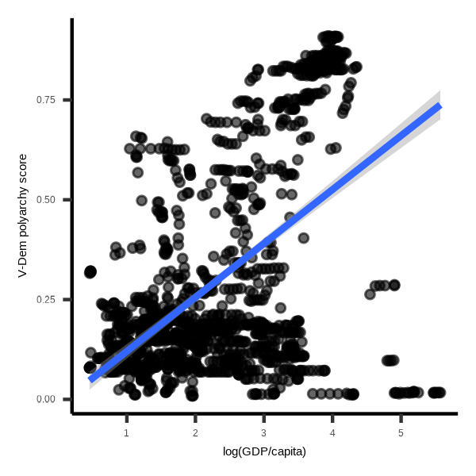

> ⚠️ **LaTex Installation**  
> See the [Installation guide](LaTex.md) for instructions on how to install LaTex.

# Introduction to R
This is the GitHub repository for the Intro to R class (AY 24/25) at SNS. On this site, you will find code, data, and other material we will use in class.
## Syllabus
- [Syllabus](Intro_to_R_Syllabus.pdf)
## Data and codebook
In the first part of the class, we will work with data on Tunisia. Below are the codebook and the data of a survey we fielded there in 2014 as well as data files containing the resulst of the 2014 and 2019 legislative elections in Tunisia. 
- [Codebook Tunisia Survey](Codebook-TUN-Survey.pdf)
- [Data Tunisia Survey](tunisia_survey.csv)
- [2014 Electoral Results](res2014.csv)
- [2019 Electoral Results](res2019.csv)
## Slides and code files
### Session 1
- [Slides session 1](Session-1.pdf)
- [Code to scrape Wikipedia](Scrape-Wikipedia.R)
### Session 2
- [Slides session 2](Session-2.pdf)
- [Code for Session 2](Session-2-code.R)
- [ggplot2 cheat sheet](https://github.com/rstudio/cheatsheets/blob/main/data-visualization.pdf)
#### Plots to reproduce:

The first four plots use the Tunisia survey data, the final four use the [V-Dem data](https://github.com/vdeminstitute/vdemdata). Feel free to pick any plot to start with--no need to follow the sequence or reproduce them all. 

- [Code](plot_code.R)
  
### Session 3
- [Slides session 3](Session-3.pdf)
- [Markdown cheat sheet](https://github.com/rstudio/cheatsheets/raw/main/rmarkdown-2.0.pdf)
- [Markdown code EDA document](EDA.Rmd)
- [Compiled PDF version of EDA document](EDA.pdf)

### Session 4
- [Slides session 4](Session-4.pdf)
- [Replication document](Replication1.pdf)

#### Analysis and data for replication
-  Goldsmith, Benjamin E. and Yusaku Horiuchi. 2012. "In Search of Soft Power: Does Foreign Public Opinion Matter for US Foreign Policy?" *World Politics* 64 (3): 555-585. [doi:10.1017/S0043887112000123](https://www.cambridge.org/core/journals/world-politics/article/in-search-of-soft-power-does-foreign-public-opinion-matter-for-us-foreign-policy/0C9DB5A0FB1EF43767932DE4E2C4DCEF)
-  The data are available [here](https://github.com/joshuaalley/cross-sectional-ols)

#### R markdown code and resources
- [Code](Replication1.Rmd)
- [Reference file](references.bib)
- [Chicago style file](chicago-author-date.csl)

### Session 5
- [Slides session 5](Session-5.pdf)

#### Analysis and data for replication
- De Bruin, Erica. 2017. "Preventing Coups d’état: How Counterbalancing Works." *Journal of Conflict Resolution* 62(7), 1433-1458. [doi:10.1177/0022002717692652](https://doi.org/10.1177/0022002717692652)
- The data are available [here](https://doi.org/10.1177/0022002717692652) (scroll all the way down)

#### R markdown resources
- [Compiled version](Replication2.pdf)
- [Markdown file](Replication.Rmd)
- [References file](references.bib)
- [CSL file](chicago-author-date.csl)

  
### Session 6
- [Slides session 6](Session-6.pdf)
- [Web scraping exercise](Scraping.pdf)
- [Markdown code](Scraping.Rmd)

### Session 7

- [Slides session 7](Session-7.pdf)

#### The LDA data generation process

#### Data
- [Jane Austin's *Pride and Predjudice*](pride_and_prejudice.txt)
- [H.G. Wells' *War of the Worlds*](war_of_the_worlds.txt)

#### Exercises

1. What are the 10 most frequent words in *Pride and Prejudice* and *War of the Worlds*? Create a plot comparing the top-10 terms from both books.
2. What does the plot tell us? Repeat step one, but remove stopwords first.
3. Create the same plot, but compare the most significant word for each book in terms of TF-IDF.

